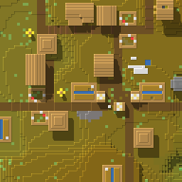

# Mapelix

Mapelix is the bastard child of
[Mojang's Minecraft Creator Tools](https://github.com/Mojang/minecraft-creator-tools) and
[uNmINeD](https://unmined.net/). It takes Mojang's official tooling for reading maps and combines
it with an almost clean-room port created by reverse-engineering a uNmINeD 0.20.1-dev binary.

This slop fork brings the look of uNmINeD maps to TypeScript as a low-level, programmatic API.
That means you can do fun stuff such as running the renderer in a browser (TODO), updating a map
dynamically, or integrating it into web frameworks.

The first prototype reads a Bedrock world, renders standard 256 by 256 XYZ tiles, and writes PNGs
that Leaflet can request as `/tiles/{z}/{x}/{y}.png`.

| Mapelix                                                                                                                       | uNmINeD                                                                                                                     |
| ----------------------------------------------------------------------------------------------------------------------------- | --------------------------------------------------------------------------------------------------------------------------- |
|  |  |

## What works

- Bedrock LevelDB table and log files, including sequence ordering and tombstones
- Modern palette subchunks, negative Y levels, and Data2D and Data3D biomes
- Native zoom levels from one to eight pixels per block
- Biome colors, elevation coloring, water depth and transparency, contours, and 3D shadows
- Transparent, Leaflet-compatible XYZ PNG tiles
- Configurable worker concurrency for large worlds
- A byte-oriented API for future live-world and Canopy integrations

The prototype has been tested with the committed Bedrock fixture, the large Stratos world, and a
current 1.2 GB Amelix SMP backup.

## Similarity to uNmINeD

The committed visual suite compares Mapelix with lossless uNmINeD renders across ten Amelix
scenes. It checks structure, block color, shadows, and tile alignment.

| Signal                     |               Baseline |
| -------------------------- | ---------------------: |
| Overall similarity         |             **97.12%** |
| Exact structural-edge F1   |                 94.52% |
| One-pixel-tolerant edge F1 |                 97.07% |
| Shadow-mask F1             |                 97.47% |
| Block-color similarity     |                 99.37% |
| Native-tile alignment      | Exact in all 10 scenes |

Run the visual suite with:

```sh
pnpm test:visual
```

See the [visual regression suite](packages/mapelix-prototype/test/visual-regression/README.md) for
the oracle, input contract, and generated reports.

## Package API

The renderer is pure TypeScript and has no native image or LevelDB dependency.

```ts
import { openBedrockWorld, writeLeafletTile } from "@mapelix/prototype";

const world = await openBedrockWorld({
  directory: "/path/to/bedrock-world",
  renderConcurrency: 2,
});

const tile = await world.renderTile({
  dimension: "overworld",
  z: 2,
  x: -32,
  y: -49,
});

await writeLeafletTile(tile, { root: "generated-tiles" });
```

This writes `generated-tiles/2/-32/-49.png`. Leaflet can request the output with
`/tiles/{z}/{x}/{y}.png`.

See [`packages/mapelix-prototype`](packages/mapelix-prototype/README.md) for the complete prototype
API and its current boundaries.

## Run it locally

Mapelix uses Node.js 24 and pnpm 11.

```sh
pnpm install
pnpm quality
pnpm test:visual
```

The real-world tests use the system `unzip` command to expand the committed `.mcworld` fixture
into a temporary directory.

## Viewer

The repository also includes a slop SvelteKit viewer. Its current manual test world is Amelix SMP
(sorry, I can't give you the world, but you can use yours!). It proves that the package can support
a real interactive Leaflet map. A Canopy integration remains future work.

Run it with a copied Bedrock world:

```sh
MAPELIX_WORLD_DIRECTORY=/path/to/world \
MAPELIX_RENDER_WORKERS=2 \
pnpm --filter @mapelix/prototype-viewer dev
```

The viewer renders visible tiles on demand and keeps a persistent PNG cache. A warm restart can
serve explored regions without reopening the world database. Set `MAPELIX_CACHE_DIRECTORY` to
choose another cache location.

## More information

- [`OPTIMIZATIONS.md`](OPTIMIZATIONS.md) records successful and failed speed, memory, and accuracy
  experiments.
- [`docs/research`](docs/research) contains clean-room notes about Minecraft map rendering and
  uNmINeD behavior.
- [`apps/prototype-viewer`](apps/prototype-viewer/README.md) documents the SvelteKit viewer.
