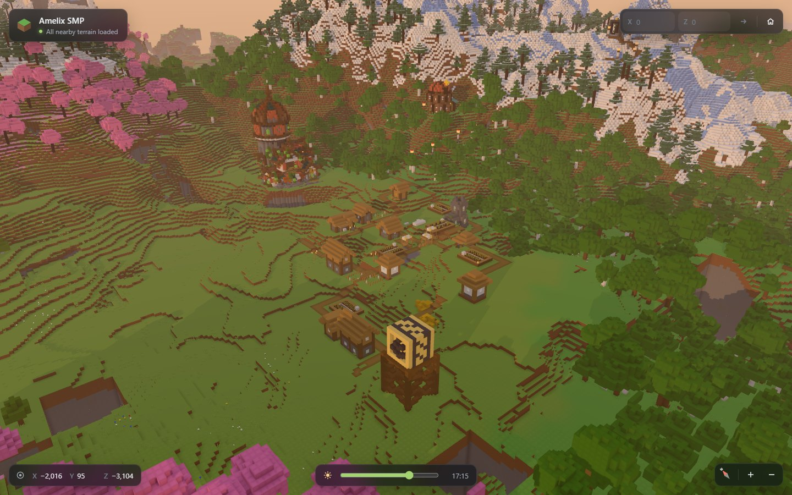

# Mapelix 3D Viewer

> Prototype app: explore a local Bedrock world in 3D in the browser.



The viewer streams the world from a local server and draws it with three.js. It uses WebGPU
when the browser supports it and falls back to WebGL 2.

```sh
MAPELIX_WORLD_DIRECTORY=/path/to/world \
pnpm --filter @mapelix/prototype-viewer-3d dev
```

Open `http://127.0.0.1:5173`. The camera starts at the world spawn.

## Settings

| Variable                  | Default                                                   | Use                                  |
| ------------------------- | --------------------------------------------------------- | ------------------------------------ |
| `MAPELIX_WORLD_DIRECTORY` | `.local/worlds/Amelix-8-12-26/Amelix SMP` in the monorepo | The extracted Bedrock world to show. |
| `MAPELIX_CACHE_DIRECTORY` | `/tmp/mapelix-scene-cache`                                | Where built regions are kept.        |
| `MAPELIX_SCENE_WORKERS`   | Two fewer than the CPU cores, from two to eight           | Worker threads that build regions.   |

The server builds each region the first time a browser asks for it and keeps the result on disk.
The cache key includes the world's table files, so a changed world builds fresh regions. Each
region response has `x-mapelix-cache: memory`, `disk`, or `build` and a `server-timing` duration.

## Controls

- Drag to move. Right-drag to turn and tilt. Scroll to zoom.
- W, A, S, and D move. Q and E turn. R and F zoom.
- Enter X and Z coordinates to fly there. The house button returns to spawn.
- The compass turns the view to face north.
- The slider sets the time of day.
- F3 shows the frame rate, the backend, and streaming statistics.

The address bar keeps the current view, so a link opens the same place. It accepts `x`, `z`,
`distance`, `heading`, and `pitch` in blocks and degrees, and `hour` from 0 to 24.

## How it draws the world

Terrain near the camera is drawn block by block. Farther away, the viewer draws cubic voxels
that start one block wide and grow to 16 blocks wide at the horizon, so builds, bridges, and
tree crowns keep their shape far away. It asks for the most useful regions first and keeps a coarse region on screen until
all of its finer replacements arrive. Regions dissolve in and out as they change.

Lighting follows the time of day. The sun casts shadows near the camera, water refracts and
reflects the sky, and glowing blocks bloom at night. Haze thickens with distance and hides the
edge of the loaded area.

In Chrome with an RTX 2070 at 1440×900, the viewer draws 320 to 360 frames per second
with the frame limit off.
